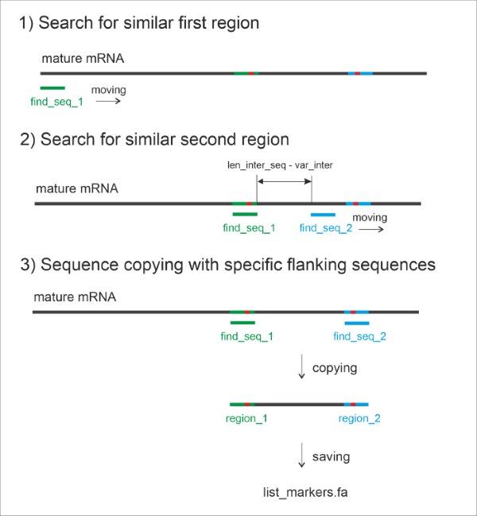

# Assignment
Need to find a sequence from a fasta file with specified parameters. The parameters are as follows:

Basic:
1) The sequence has two regions with a specific sequence, but mismatch (1-2 nt.) is allowed.
2) The length between the two regions is approximately 37 nt. (Internal sequence length in nt.)

Additional:
1) Sequence must be unique by NCBI Blastnt.
2) Conserved (from exons that are in all alternative splicing variants)
3) The sequence must not form a stable secondary structure according to mfold - Quikfold (with Energy rules: RNA 4.0).

# Idea of Searching

# Running
1. To run jupyter notebook **find_marker.ipynb**
2. In the **--------SETUP FOR SEARCHING--------** block enter the values of the parameter to be searched. 
3. Run all blocks in sequence.
4. You will get file **list_markers.fa** with all markers. You can upload this one to NCBI blastnt for
finding the uniq marker.

# Video manual
https://youtu.be/PRGQTKMdYFg